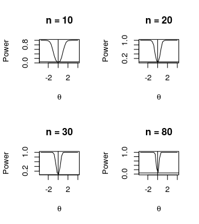
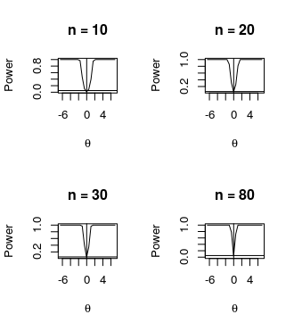
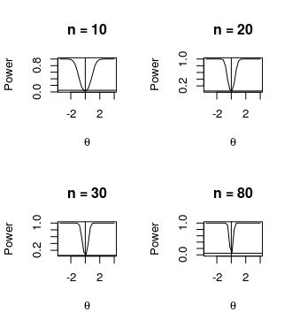
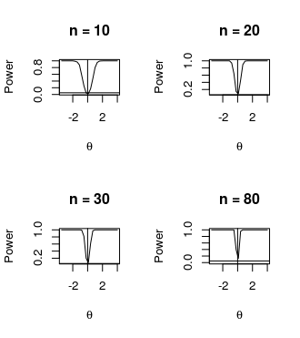

# Power-Binomial-Test
In statistical inference, we develop hypothesis testing over a distribution by using a test statistic.  
With the aim to compare the performance of the test statistic T in the following hypotheses , we generate data from 5 different distributions :

  - Normal(0.5,1);
  
  - Uniform(0,1);
  
  - Contaminated Normal 5%, 10%, 50%
 ## Normal
 
 
 ## Uniform
 
 
 ## Contaminated delta = 5%
 
 
 ## Contaminated delta = 10%
 
 
 ## Contaminated delta = 50%
 
